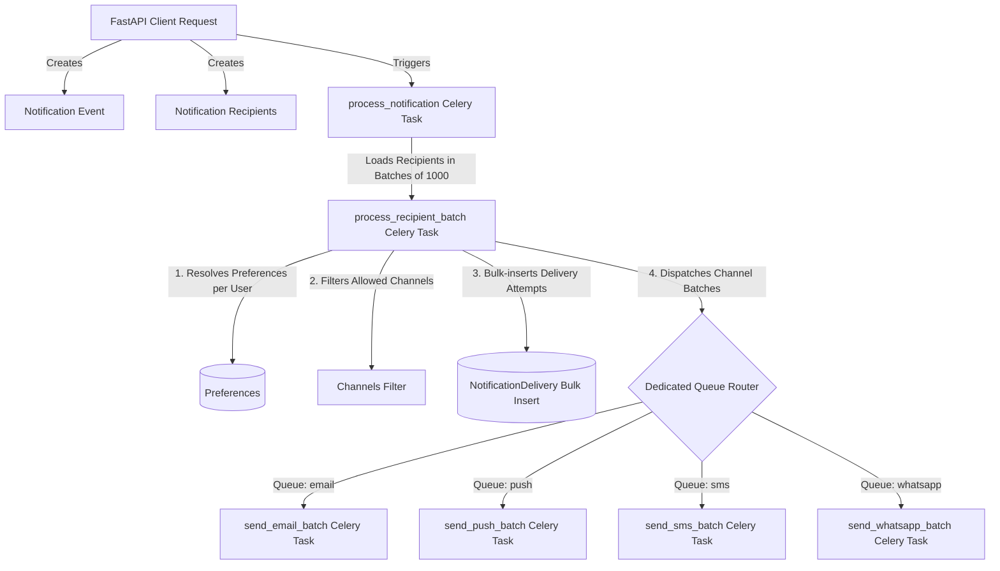

# Scalable Distributed Notification Pipeline Architecture

This document describes the high-volume notification processing architecture designed for **Tasker API**. The pipeline is decoupled, fanned-out, and batched to handle scaling to millions of recipients efficiently without overloading database connections or the message broker (Redis).

---

## 1. High-Level Pipeline Flow



---

## 2. Core Components

### 2.1 Database Models
All models reside in [notifications.py](file:///c:/Users/USER/Desktop/Development/Tasker/tasker_api/app/core/models/notifications.py):

*   [Notification](file:///c:/Users/USER/Desktop/Development/Tasker/tasker_api/app/core/models/notifications.py#L57): Represents the single notification event (independent of recipients). Contains fields like `title`, `body`, custom `data` payload, and optional `channels` constraint.
*   [NotificationRecipient](file:///c:/Users/USER/Desktop/Development/Tasker/tasker_api/app/core/models/notifications.py#L92): Maps the notification to a target user and tracks the state of the in-app notification feed.
*   [NotificationDelivery](file:///c:/Users/USER/Desktop/Development/Tasker/tasker_api/app/core/models/notifications.py#L114): Tracks individual delivery attempts per channel (e.g. `email`, `sms`, `push`, `whatsapp`) for a specific recipient.
*   [NotificationPreference](file:///c:/Users/USER/Desktop/Development/Tasker/tasker_api/app/core/models/notifications.py#L138): Configures per-user preference toggles mapping `NotificationType` and `NotificationChannel` to an enabled state.

### 2.2 Backend Service
*   [NotificationService.create_notification](file:///c:/Users/USER/Desktop/Development/Tasker/tasker_api/app/features/notifications/services.py#L47): Handles notification creation logic (called internally by other backend services). It writes the `Notification` record and creates the `NotificationRecipient` rows, then schedules the first Celery task (`process_notification.delay()`).

### 2.3 Celery Tasks
All pipeline stages reside in [tasks.py](file:///c:/Users/USER/Desktop/Development/Tasker/tasker_api/app/features/notifications/tasks.py):

*   [process_notification](file:///c:/Users/USER/Desktop/Development/Tasker/tasker_api/app/features/notifications/tasks.py#L44): **The Fan-Out Task**. It processes one notification at a time, paginating recipients in batches of 1,000 using SQL `LIMIT`/`OFFSET` to avoid memory exhaustion. It dispatches a batch worker task for each page.
*   [process_recipient_batch](file:///c:/Users/USER/Desktop/Development/Tasker/tasker_api/app/features/notifications/tasks.py#L125): **The Batch Worker**. It performs bulk operations:
    1.  Loads preferences for all recipients in the batch in one query.
    2.  Validates user preferences and filters by requested notification target channels.
    3.  Bulk-inserts `NotificationDelivery` attempts (one statement instead of sequential insertions).
    4.  Updates `NotificationRecipient` statuses in bulk.
    5.  Groups delivery IDs by channel and schedules channel-specific batch tasks.
*   [send_email_batch](file:///c:/Users/USER/Desktop/Development/Tasker/tasker_api/app/features/notifications/tasks.py#L280), [send_sms_batch](file:///c:/Users/USER/Desktop/Development/Tasker/tasker_api/app/features/notifications/tasks.py#L376), [send_push_batch](file:///c:/Users/USER/Desktop/Development/Tasker/tasker_api/app/features/notifications/tasks.py#L483), [send_whatsapp_batch](file:///c:/Users/USER/Desktop/Development/Tasker/tasker_api/app/features/notifications/tasks.py#L607): **Channel Batch Tasks**. They invoke external APIs (SendGrid, Twilio, FCM, etc.) and record final outcomes in bulk.

---

## 3. Status and Lifecycle Semantics

Understanding status transitions is key to avoiding synchronization confusion:

### NotificationRecipient (`RecipientStatus`)
*   `PENDING`: Event is initialized.
*   `SENT`: Fanned out and handed off to Celery queues (visible in the user's in-app feed).
*   `READ`: The user viewed/opened the in-app notification.

> [!NOTE]
> The `NotificationRecipient` is marked `SENT` *before* external deliveries (e.g. Email/SMS) complete. This activates the in-app inbox entry immediately, keeping delivery channel latencies isolated.

### NotificationDelivery (`DeliveryStatus`)
*   `PENDING`: Delivery job is queued, waiting for provider submission.
*   `DELIVERED`: Provider successfully processed/sent the request.
*   `FAILED`: Delivery attempt encountered a retryable error (retries automatically scheduled with exponential backoff).
*   `PERMANENT_FAILURE`: Delivery cannot proceed (e.g. missing phone number/messaging token).

---

## 4. Multi-Queue Scaling and Concurrency

To prevent slow external integrations (e.g. email provider latency) from bottlenecking critical alerts (e.g. push notifications), tasks are routed to dedicated queues configured in [celery_app.py](file:///c:/Users/USER/Desktop/Development/Tasker/tasker_api/app/celery_app.py):

| Pipeline Stage / Task Name | Assigned Queue | Recommendation |
| :--- | :--- | :--- |
| `notifications.process_notification` | `notifications` | High throughput |
| `notifications.process_recipient_batch` | `notifications` | High database bandwidth |
| `notifications.send_email_batch` | `email` | IO-bound, rate-limited by ESP |
| `notifications.send_sms_batch` | `sms` | SMS gateway rate limits |
| `notifications.send_push_batch` | `push` | High concurrency, fast delivery |
| `notifications.send_whatsapp_batch` | `whatsapp` | WhatsApp Business rate limits |

### Production Deployment Commands
Run Celery workers with dedicated queues to target scale independently:

```bash
# General pipeline workers
celery -A app.celery_app worker -Q notifications --concurrency=4

# High-concurrency push alerts
celery -A app.celery_app worker -Q push --concurrency=50

# Rate-limited providers (e.g., Email, SMS)
celery -A app.celery_app worker -Q email --concurrency=10
celery -A app.celery_app worker -Q sms --concurrency=5
```

---

## 5. Performance Utilities

To prevent database roundtrips, the pipeline relies on bulk operations defined in [Repository](file:///c:/Users/USER/Desktop/Development/Tasker/tasker_api/app/core/repository.py#L20):

*   **`bulk_add`**: Accumulates multiple entity instantiations and submits them using `session.add_all()`.
*   **`bulk_update`**: Executes a SQL `UPDATE ... WHERE id IN (...)` statement, avoiding loading entities first or writing sequential updates.

---

## 6. Client API Endpoints

The notifications router in [notifications.py](file:///c:/Users/USER/Desktop/Development/Tasker/tasker_api/app/features/notifications/router/notifications.py) and preferences router in [preferences.py](file:///c:/Users/USER/Desktop/Development/Tasker/tasker_api/app/features/notifications/router/preferences.py) expose only client-facing operations:

*   **`GET /api/v1/notifications/`**: List current user's notifications (paginated, sorted by newest first).
*   **`POST /api/v1/notifications/mark-read`**: Mark one or more notifications as read for the current user.
*   **`GET /api/v1/notifications/counts`**: Get both read and unread notification counts for the current user.
*   **`GET /api/v1/notifications/preferences/`**: Get the current user's notification preferences.
*   **`PUT /api/v1/notifications/preferences/`**: Bulk update/toggle user notification preferences.

